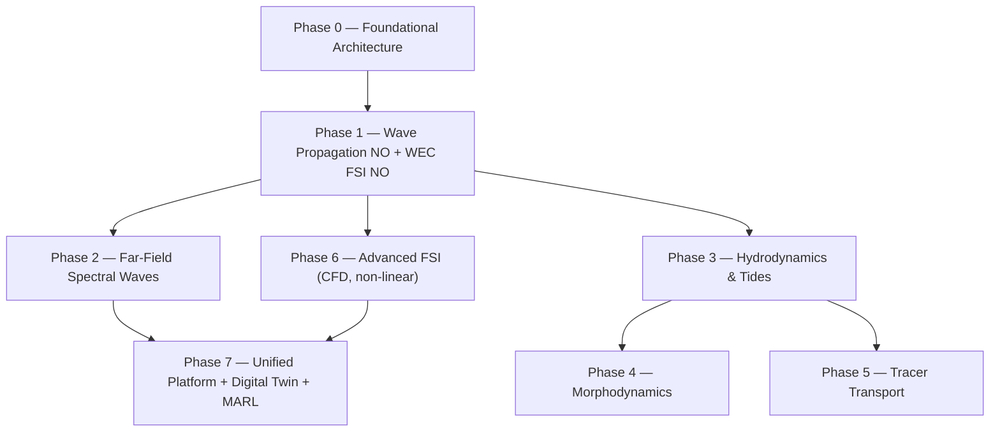

# NOSSO-MAR Roadmap

```mermaid
flowchart TB
    P0["Phase 0 — Foundational Architecture"]
    P1["Phase 1 — Wave Propagation NO + WEC FSI NO"]
    P2["Phase 2 — Far-Field Spectral Waves"]
    P3["Phase 3 — Hydrodynamics & Tides"]
    P4["Phase 4 — Morphodynamics"]
    P5["Phase 5 — Tracer Transport"]
    P6["Phase 6 — Advanced FSI (CFD, non-linear)"]
    P7["Phase 7 — Unified Platform + Digital Twin + MARL"]
    P0-->P1; P1-->P2; P1-->P3; P3-->P4; P3-->P5; P1-->P6; P2-->P7; P6-->P7
```
