# NOSSO-MAR — Architecture Description

**Version**: Phase 1 (Tasks T00–T07 complete)
**Standard**: Adapted from ISO/IEC 42010:2011 (Systems and software engineering — Architecture description)
**Views**: Logical · Process · Development · Physical

---

## 1. Document Purpose and Scope

This document describes the internal architecture of NOSSO-MAR across all
eight phases of the project. It covers:

- Component inventory and runtime structure (Logical View)
- Data flow and behavioral sequences (Process View)
- Module dependencies and code organisation (Development View)
- Deployment targets (Physical View)
- Architectural decisions with rationale (ADRs)
- Phase-by-phase component evolution

This document is for **contributors, collaborators, and technical reviewers**.
For the scientific vision and quickstart, see `README.md`.
For the implementation checklist, see `docs/PHASE_1_ROADMAP.md`.

**Notation**:
- `✓` — implemented and tested
- `→` — in progress
- `○` — planned (skeleton or not started)
- `[Pn]` — introduced in Phase n

---

## 2. System Overview

### 2.1 Mission and Quality Attributes

| Quality attribute | Target | Mechanism |
|-------------------|--------|-----------|
| **Performance** | 100×–1000× speedup vs. classical solvers | Neural operator inference replaces iterative solver |
| **Physical correctness** | B(ω) ≥ 0 always; EOM residual → 0 | Physics loss with curriculum; validation checks |
| **Extensibility** | New operator family in < 1 day | `factory.py` registry; `BaseOperator` interface |
| **Reproducibility** | ±0.1% result variance with fixed seed | LHS split-by-family; Normalizer saved with checkpoint |
| **Openness** | No proprietary solver on critical path | Synthetic FD runner (Path C) always available |
| **Testability** | All contracts validated at construction | `WECState.__post_init__` raises on invalid inputs |
| **Interoperability** | Outputs comparable to SWAN, Delft3D, WEC-Sim | Output catalogue with format exporters (T18) |

### 2.2 System Context

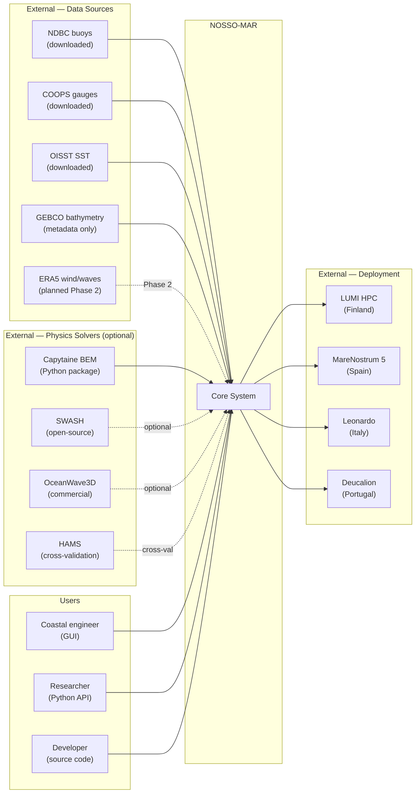

### 2.3 External Interfaces

| Entity | Type | Interface | Status |
|--------|------|-----------|--------|
| NDBC | Data source | HTTP download → `.txt` parse | ✓ |
| COOPS | Data source | HTTP download → `.json` parse | ✓ |
| OISST | Data source | HTTP download → `.nc` (netCDF4) | ✓ |
| GEBCO | Data source | HTML metadata; `.nc` download pending | metadata ✓ |
| Capytaine | Python package | `import capytaine` → `capytaine_runner.py` | ○ T08 |
| ERA5 | Data source | CDS API → `.nc` | ○ Phase 2 |
| HPC clusters | Deployment | SLURM `sbatch`; DDP via NCCL | ○ Phase 2 |

---

## 3. Fidelity Architecture

NOSSO-MAR operates across five fidelity levels. Each level has a defined
state space, data format, and governing equation. Outputs from one level
**must not** be compared directly to another level without an explicit bridge.

### 3.1 Fidelity Ladder

| Level | Name | State space | Format | Governing equation |
|-------|------|-------------|--------|--------------------|
| **L0** | Observations | Time series at point locations | `.txt`, `.json`, `.nc` | Measurement model |
| **L1** | Spectral | S(f,θ), Hs, Tp, Tm01 | arrays (numpy) | Wave-action balance |
| **L2** | Phase-resolved | η(x,y,t), u, v, h | Tensor (T,H,W), Zarr | Shallow-water / NLSWE |
| **L3** | WEC response | A(ω), B(ω), Fex, motion, power | `WECState`, arrays (ω) | Frequency-domain EOM |
| **L4** | CFD / FSI | u, v, w, p fields | Dense tensor, `.nc` | Navier-Stokes |

### 3.2 Bridge Connectors — `src/nossomar/physics/multifidelity.py`

| Bridge function | From | To | Use |
|----------------|------|----|-----|
| `phase_series_to_spectrum(eta, dt)` | L2 → | L1 | Validate F1B output against spectral targets |
| `bulk_wave_statistics(freq, S)` | L1 → | scalars | Hs, Tp, Tm01, Te from spectrum |
| `spectral_moments(freq, S, orders)` | L1 → | m₋₁,m₀,m₁,m₂ | Spectral moments for statistics |
| `reconstruct_irregular_wave(freq, S, dt)` | L1 → | L2 | Synthesise η(t) for BCs |
| `cfd_snapshot_to_phase_fields(cfd)` | L4 → | L2 | Downgrade CFD for Stage D calibration |
| `summarize_frequency_response(A, B, Fex)` | L3 → | scalars | Peak, bandwidth for cross-fidelity loss |

### 3.3 Fidelity Rules

1. **Rule 1 — No direct cross-level comparison**: L4 CFD outputs are never
   compared to L1 spectral products. Use a bridge first.
2. **Rule 2 — Bridge direction is explicit**: every bridge function has a
   declared source and target level in its docstring.
3. **Rule 3 — Bridges used in loss**: `cross_fidelity` term in `total_loss()`
   always calls a bridge before computing the residual.

---

## 4. Logical View — Components and Connectors

### 4.1 Component Diagram

```mermaid
graph TD
    subgraph Config["Configuration Layer"]
        YAML["YAML configs\n(site · forcing · training · HPC · outputs)"]
    end

    subgraph Data["Data Layer ✓"]
        AW["analytic_wec.py\nSynthetic BEM data"]
        CAP_R["capytaine_runner.py\nBEM sweep ○"]
        WFR["wave_field_runner.py\nSolver sweep ○"]
        ODP["open_data_*.py\nNDBC · COOPS · OISST"]
        WDS["wec_dataset.py\nWECDataset"]
        WFS["wave_dataset.py\nWaveFieldDataset ○"]
    end

    subgraph Core["Core Contracts ✓"]
        WEC["WECState"]
        WF["WaveField"]
        OS["OceanState"]
        GD["GridDefinition"]
        MFS["MultiFidelitySample"]
    end

    subgraph Operators["Operator Layer ✓"]
        FAC["factory.py\nbuild_operator()"]
        BASE["BaseOperator\n(abstract)"]
        FNO["FNO2d · FFNO2d\nGeoFNO2d · FNO3d"]
        WNO["WNO"]
        GNO["GraphNeuralOperator"]
        DON["DeepONet\nPI-DeepONet"]
        RINO["RINO2d"]
    end

    subgraph Physics["Physics Layer ✓"]
        RES["residuals_torch.py\nNS · SW · WAB · Exner · WEC-EOM"]
        MF["multifidelity.py\nFidelity bridges"]
    end

    subgraph Loss["Loss Layer ✓"]
        PL["physics_losses.py\ndamping_nonneg · wec_eom\ntotal_loss · CurriculumWeight"]
    end

    subgraph Training["Training Layer →"]
        TW["train_wec.py\nF1A training loop"]
        TW2["train_wave.py ○\nF1B training loop"]
        NORM["Normalizer\nbranch/trunk/target stats"]
    end

    subgraph Coupling["Coupling Layer ○"]
        IC["IterativeCoupler\nF1C loop"]
        RM["AnalyticRadiationModel\nHaskind relation"]
    end

    subgraph Farm["Farm Layer ○"]
        WEF["WECFarm\nsimulate()"]
        FR["FarmResult"]
    end

    subgraph UQ["Uncertainty Layer ○"]
        CP["ConformalPredictor\ncalibrate · predict_interval\nextrapolation_flag · fallback_trigger"]
    end

    subgraph SiteConf["Site Config Layer ○"]
        SB["SiteBuilder"]
        FB["ForcingBuilder"]
        OC["OutputConfig"]
    end

    subgraph App["Application Layer ○"]
        GUI["Streamlit App\n5 tabs"]
        CB["ConfigBridge\nGUI state → YAML"]
    end

    subgraph Future["Future Phases ○"]
        ENKF["assimilation/\nEnKF · 4D-Var [P2]"]
        DT["digital_twin/\nSensor · StateEstimator [P7]"]
        RL["reinforcement/\nMADDPG · MAPPO [P7]"]
        HPC["hpc/\nDDP · SLURM [P2]"]
    end

    YAML --> TW
    YAML --> TW2
    YAML --> WEF
    YAML --> CB

    AW --> WDS
    CAP_R --> WDS
    WFR --> WFS
    ODP --> WDS

    WDS --> TW
    WFS --> TW2

    FAC --> BASE
    BASE --> FNO
    BASE --> WNO
    BASE --> GNO
    BASE --> DON
    BASE --> RINO

    RES --> PL
    MF --> PL

    PL --> TW
    PL --> TW2

    TW --> NORM
    TW --> DON
    TW --> GNO

    TW2 --> FNO
    TW2 --> WNO

    DON --> IC
    FNO --> IC
    WNO --> IC
    GNO --> IC
    RM --> IC

    IC --> WEF
    CP --> WEF
    WEF --> FR

    SB --> WEF
    FB --> WEF
    OC --> FR

    CB --> SB
    CB --> FB
    CB --> OC
    GUI --> CB
    GUI --> WEF

    WEC --> OS
    WF --> OS
    GD --> MFS

    ENKF -.->|Phase 2| IC
    DT -.->|Phase 7| WEF
    RL -.->|Phase 7| WEF
    HPC -.->|Phase 2| TW
```

### 4.2 Key Connectors

| Connector | Signature | Role |
|-----------|-----------|------|
| **Operator construction** | `build_operator(name: str, cfg: dict) → BaseOperator` | Decouples callers from operator classes |
| **Operator evaluation** | `forward(u: Tensor, query_points: Tensor = None) → Tensor` | Uniform interface across all families |
| **Loss aggregation** | `total_loss(supervised, physics, cross_fidelity, weights) → Tensor` | Single loss entry point for training loop |
| **Physics schedule** | `CurriculumWeight(epoch: int) → float` | Ramps physics weight without modifying training loop |
| **State serialisation** | `WECState.to_dict() / from_dict()` | JSON round-trip for dataset persistence |
| **Configuration** | `YAML → dict → cfg` | `PyYAML.safe_load()` → passed as `cfg` to constructors |
| **Dataset I/O** | `WECDataset(json_path, split)` | PyTorch Dataset API; Zarr planned in T08 |

### 4.3 Tensor Contracts

| Operator | Input `u` | Query points | Output |
|----------|-----------|-------------|--------|
| `FNO2d` | `(B, C_in, H, W)` | — | `(B, C_out, H, W)` |
| `FFNO2d` | `(B, C_in, H, W)` | — | `(B, C_out, H, W)` |
| `GeoFNO2d` | `(B, C_in, H, W)` | — | `(B, C_out, H, W)` |
| `FNO3d` | `(B, C_in, H, W, D)` | — | `(B, C_out, H, W, D)` |
| `WNO` | `(B, C_in, H, W)` | — | `(B, C_out, H, W)` |
| `GNO` | `(N_nodes, node_in_dim)` | — | `(N_nodes, node_out_dim)` |
| `DeepONet` | branch `(B, branch_dim)` | trunk `(N_q, trunk_dim)` | `(B, N_q, C_out)` |
| `PI-DeepONet` | branch `(B, branch_dim)` | trunk `(N_q, trunk_dim)` | `(B, N_q, C_out)` |
| `RINO2d` | `(B, C_in, H_in, W_in)` | `(B, N_q, 2)` optional | `(B, C_out, H, W)` or `(B, N_q, C_out)` |

**F1A specific** (DeepONet):
- `branch_dim = BRANCH_DIM = 10` (device params: radius, draft, mass, bpto, depth + normalised features)
- `trunk_dim = TRUNK_DIM = 7` (frequency features: ω, ω², cos(ω), sin(ω), tanh(ω), log(ω+1), 1)
- `C_out = 4` (A, B, Fex_real, Fex_imag)

**F1B specific** (FNO2d / WNO):
- `C_in = 5` (bathymetry h, Hs, Tp, cos(dir), sin(dir))
- `C_out = 3` (η, u, v)
- `H = W = 128` (25 m resolution, 3.2 km domain)

### 4.4 Configuration Connector

YAML files are the primary mechanism for parameterising all components.
They are loaded via `PyYAML.safe_load()` and passed as `cfg: dict` to
operator constructors, training loops, and site builders.

```
configs/
  training/
    deeponet_wec_full.yaml  → train_wec.py  → build_operator("deeponet", cfg)
    f1b_operators_full.yaml → train_wave.py → build_operator("fno2d", cfg)
  scenarios/
    phase1_full_f1a.yaml    → generate_f1a_dataset.py → CapytaineRunner
  hpc/
    deucalion.yaml          → slurm_launcher.py → SLURM job script
  sites/
    viana_dataset.yaml      → prepare_viana_dataset.py → SiteConfig
  outputs/
    full.yaml               → OutputConfig → OutputWriter → NetCDF
```

---

## 5. Logical View — Class Structure

### 5.1 IO Contracts

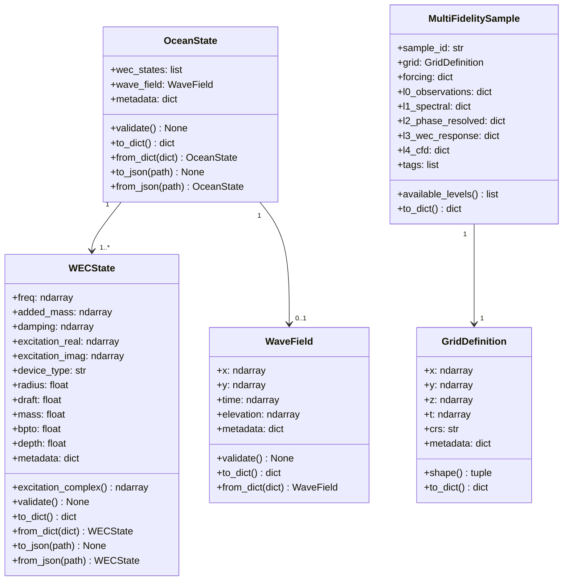

### 5.2 Operator Hierarchy

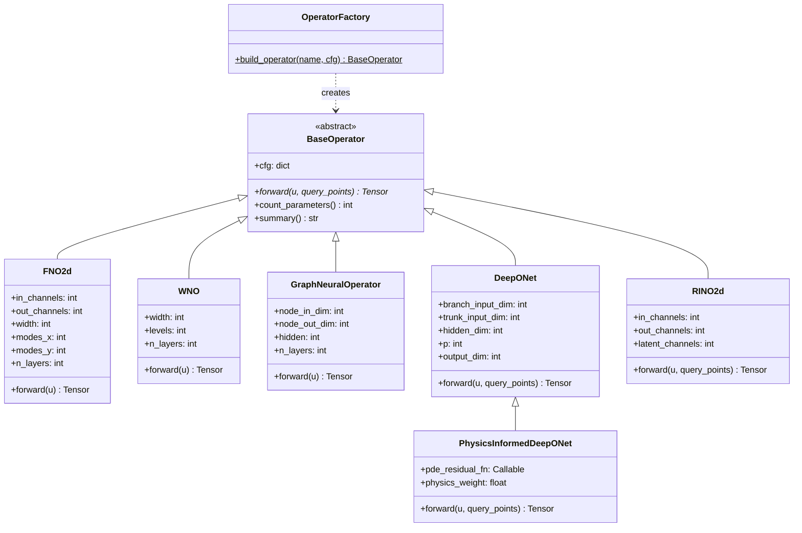

### 5.3 Loss Module

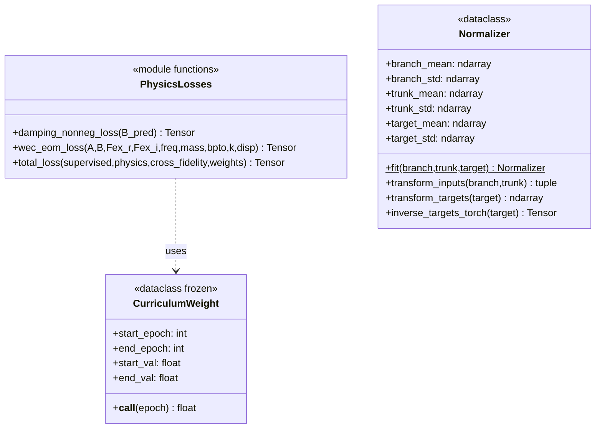

---

## 6. Process View — Data Flow

### 6.1 Training Pipeline

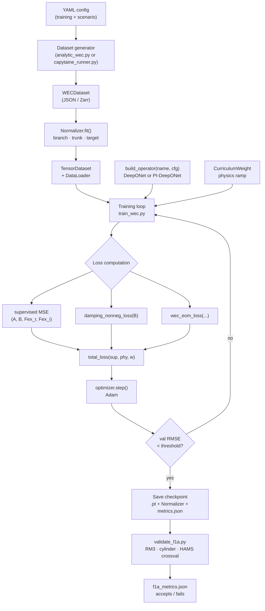

### 6.2 Inference / Farm Simulation Pipeline

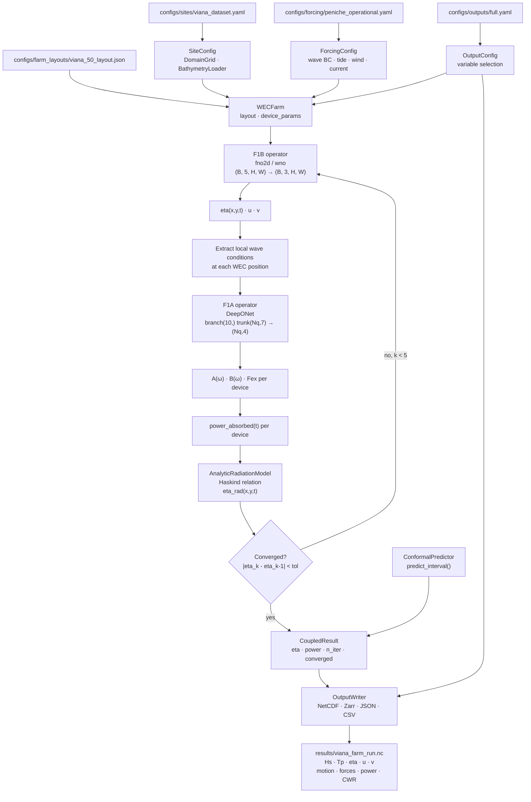

---

## 7. Process View — Behavior Sequences

### 7.1 F1C Coupling Iteration

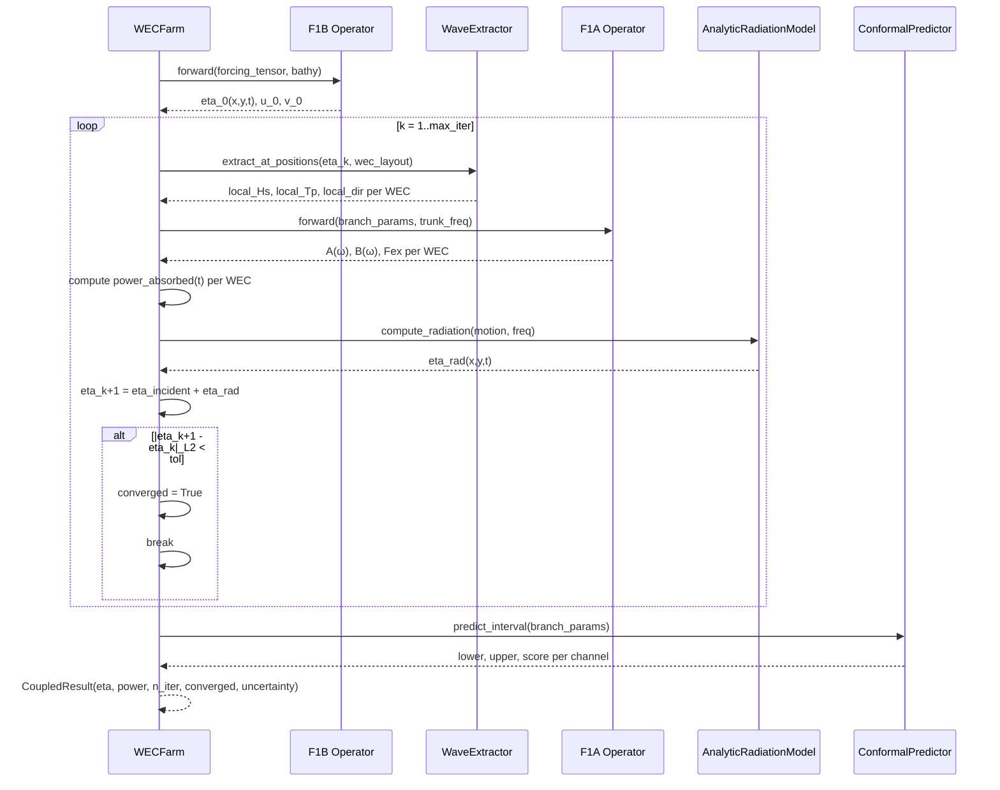

### 7.2 farm.simulate() — Full Call Sequence

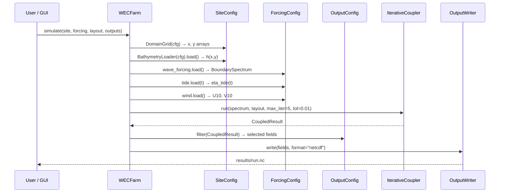

---

## 8. Process View — Error Handling

| Failure | Location | Behaviour |
|---------|----------|-----------|
| Capytaine non-convergence | `capytaine_runner.py` | `ProcessPoolExecutor` catches exception, logs case ID and params, continues sweep. Final dataset may have `< n_samples` records. Metadata records actual count. |
| Analytic generator invalid params | `analytic_wec.py` | `WECState.__post_init__` raises `ValueError` immediately. Caller must validate input before passing. |
| F1C non-convergence | `IterativeCoupler.run()` | Returns `CoupledResult(converged=False, n_iterations=max_iter)`. Caller checks `result.converged` before using power estimates. |
| UQ extrapolation | `ConformalPredictor.extrapolation_flag()` | Returns `True` if input params outside training bounds. No exception — caller decides to use result with warning or trigger fallback. |
| UQ fallback trigger | `ConformalPredictor.fallback_trigger()` | Returns `True` if `uncertainty > 0.30 × signal`. Farm layer may invoke BEM solver directly for that device. |
| YAML key missing | All `from_yaml()` loaders | `KeyError` with message naming the missing field. No silent defaults for physically significant parameters. |

---

## 9. Development View — Module Structure

### 9.1 Module Dependency Graph

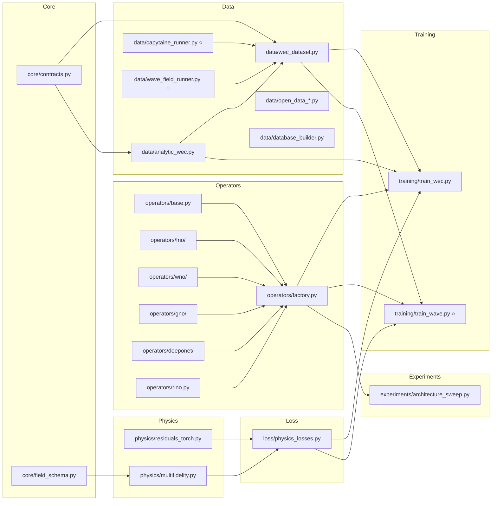

### 9.2 Module Catalogue

| Module | Description | Status | Spec |
|--------|-------------|--------|------|
| `core/contracts.py` | `WECState`, `WaveField`, `OceanState` | ✓ | Spec 01 |
| `core/field_schema.py` | `GridDefinition`, `MultiFidelitySample` | ✓ | Spec 01 |
| `data/analytic_wec.py` | Closed-form BEM (Hulme 1982 cylinder) | ✓ | Spec 08 |
| `data/wec_dataset.py` | `WECDataset`, LHS split, JSON I/O | ✓ | Spec 08 |
| `data/open_data_catalog.py` | Curated open data source catalogue | ✓ | Spec 02 |
| `data/open_data_fetchers.py` | HTTP downloaders for NDBC, COOPS, OISST | ✓ | Spec 02 |
| `data/database_builder.py` | Local manifest builder | ✓ | Spec 02 |
| `data/capytaine_runner.py` | Capytaine BEM sweep + LHS | ○ T08 | Spec 08 |
| `data/wave_field_runner.py` | Phase-resolving solver runner | ○ T10 | Spec 11 |
| `data/wave_dataset.py` | `WaveFieldDataset`, Zarr I/O | ○ T10 | Spec 11 |
| `operators/base.py` | `BaseOperator` abstract class | ✓ | Spec 03 |
| `operators/factory.py` | `build_operator()` registry | ✓ | Spec 03 |
| `operators/fno/fno2d.py` | FNO2d — regular grid wave fields | ✓ | Spec 04 |
| `operators/fno/ffno.py` | Factorized FNO — high-res / HPC | ✓ | Spec 04 |
| `operators/fno/fno3d.py` | FNO3d — 3D fields (Phase 6) | ✓ | — |
| `operators/fno/geo_fno.py` | GeoFNO2d — geometry-aware | ✓ | Spec 04 |
| `operators/wno/` | WNO — multi-scale, shoaling | ✓ | Spec 04 |
| `operators/gno/` | GNO — irregular mesh, WEC arrays | ✓ | Spec 03 |
| `operators/deeponet/deeponet.py` | DeepONet — WEC response surface | ✓ | Spec 03 |
| `operators/deeponet/physics_deeponet.py` | PI-DeepONet — EOM residual | ✓ | Spec 03 |
| `operators/rino.py` | RINO2d — resolution transfer | ✓ | Spec 04 |
| `physics/residuals_torch.py` | NS, SW, WAB, Exner, WEC-EOM residuals | ✓ | Spec 06 |
| `physics/multifidelity.py` | Fidelity bridge functions | ✓ | Spec 10 |
| `loss/physics_losses.py` | `damping_nonneg`, `wec_eom`, `total_loss`, `CurriculumWeight` | ✓ | Spec 09 |
| `training/train_wec.py` | F1A PyTorch training loop | → T06 | Spec 09 |
| `training/train_wave.py` | F1B training loop | ○ T11 | Spec 12 |
| `experiments/architecture_sweep.py` | Smoke sweep all operator families | ✓ | Spec 09 |
| `coupling/iterative_coupler.py` | F1C iterative loop | ○ T13 | Spec 05 |
| `coupling/radiation_model.py` | Haskind analytic radiation (Phase 1) | ○ T13 | Spec 05 |
| `farm/wec_farm.py` | `WECFarm.simulate()` → `FarmResult` | ○ T15 | — |
| `uncertainty/conformal.py` | Conformal prediction, fallback trigger | ○ T14 | Spec 07 |
| `config/site_builder.py` | `SiteConfig`, `DomainGrid`, `BathymetryLoader` | ○ T16 | Spec 17 |
| `config/forcing_builder.py` | Wave, tide, wind, current loaders | ○ T17 | Spec 18 |
| `config/output_config.py` | `OutputConfig`, `OutputWriter`, `ValidationExporter` | ○ T18 | Spec 19 |
| `assimilation/` | EnKF, 4D-Var, observation operators | ○ [P2] | Spec DA |
| `digital_twin/` | Sensor ingest, state estimator, dashboard | ○ [P7] | — |
| `reinforcement/` | MADDPG, MAPPO, WaveFarmEnv | ○ [P7] | — |
| `hpc/` | DDP, SLURM launcher, mixed precision | ○ [P2] | — |

---

## 10. Physical View — Deployment

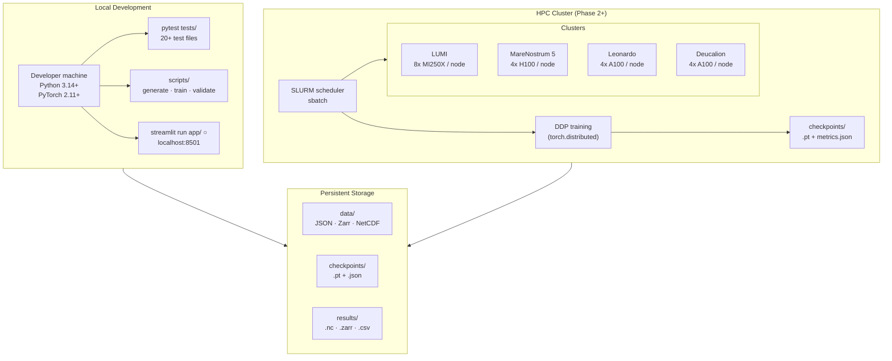

**Runtime requirements**:

| Requirement | Value |
|-------------|-------|
| Python | ≥ 3.14 |
| PyTorch | ≥ 2.11 |
| NumPy | ≥ 2.4 |
| SciPy | ≥ 1.17 |
| xarray | ≥ 2026.4 |
| netCDF4 | ≥ 1.7 |
| pandas | ≥ 3.0 |
| requests | ≥ 2.33 |
| PyYAML | ≥ 6.0 |

---

## 11. Phase-by-phase Architecture Evolution

| Phase | New components added to inventory |
|-------|----------------------------------|
| **0** ✓ | `core/contracts.py`, `core/field_schema.py`, all `operators/`, `physics/residuals_torch.py`, `physics/multifidelity.py`, `data/analytic_wec.py`, `data/wec_dataset.py`, `data/open_data_*.py`, `experiments/architecture_sweep.py` |
| **1** → | `loss/physics_losses.py` ✓; `data/capytaine_runner.py`, `data/wave_field_runner.py`, `data/wave_dataset.py`, `training/train_wave.py`, `coupling/`, `farm/`, `uncertainty/`, `config/`, `app/` ○ |
| **2** | `assimilation/enkf.py`, `assimilation/four_dvar.py`, `assimilation/observation_operator.py`, `assimilation/state_vector.py`, `hpc/distributed_trainer.py`, `hpc/slurm_launcher.py` |
| **3** | `physics/tidal_module.py`, `physics/wave_current_interaction.py`, new residuals in `residuals_torch.py` (tidal barotropic) |
| **4** | `physics/sediment_transport.py`, new `exner_residual` consumers, morphodynamic training loop |
| **5** | `physics/tracer_transport.py`, advection-diffusion residual |
| **6** | `operators/fno/fno3d.py` (already exists), CFD data pipeline, `data/cfd_runner.py` |
| **7** | `digital_twin/sensor_interface.py`, `digital_twin/state_estimator.py`, `digital_twin/twin_manager.py`, `reinforcement/agents/layout_agent.py`, `reinforcement/agents/pto_agent.py`, `reinforcement/algorithms/maddpg.py`, `reinforcement/algorithms/mappo.py`, `reinforcement/environment/wave_farm_env.py` |

---

## 12. Architectural Decision Records

### ADR-01 — Multiple operator families, not a monolithic surrogate
**Status**: Accepted (Phase 0)
**Context**: A single operator family could be forced to handle all sub-problems,
reducing codebase complexity at the cost of physical accuracy per domain.
**Decision**: Each physical sub-problem has the operator family best suited to
its geometry and data structure. FNO2d for regular wave fields, GNO for
irregular meshes and WEC arrays, DeepONet for frequency-domain response surfaces.
**Consequences**: More classes to maintain; `factory.py` registry decouples callers;
architecture sweep (`experiments/architecture_sweep.py`) catches regressions.

### ADR-02 — Explicit fidelity bridges; no direct cross-level comparison
**Status**: Accepted (Phase 0)
**Context**: Comparing CFD pressure fields directly to spectral Hs would produce
meaningless metrics and invisible training errors.
**Decision**: `multifidelity.py` provides explicit, one-directional bridge
functions. The cross-fidelity loss term always calls a bridge before computing
the residual. This is enforced by design, not convention.
**Consequences**: Every new physics module must declare which fidelity level it
operates at and which bridges it requires.

### ADR-03 — Open data first; no proprietary solver on the critical path
**Status**: Accepted (Phase 0)
**Context**: OceanWave3D (commercial) and SWASH (requires setup) would block
dataset generation for most contributors.
**Decision**: Every data generation pipeline has a Path C — a synthetic
finite-difference or analytic fallback that requires no external dependency.
`analytic_wec.py` (T01) and `synthetic_fd_runner.py` (planned T10) implement this.
**Consequences**: Path C data is lower fidelity. The training pipeline is
identical regardless of path, so higher-fidelity data can replace it later.

### ADR-04 — Contracts-first TDD; contracts validate at construction
**Status**: Accepted (Phase 0)
**Context**: Silent invalid states (e.g. `damping < 0`) would produce
physically meaningless training signals that are hard to debug.
**Decision**: `WECState.__post_init__` raises `ValueError` on any physically
invalid input. Tests are written before implementations. No operator is
added without a passing test.
**Consequences**: Early failure on bad data; `validate()` is called in
`__post_init__`, not lazily. All tests live in `tests/` and run via `pytest`.

### ADR-05 — Physics loss curriculum: weight starts at 0, ramps linearly
**Status**: Accepted (Phase 1)
**Context**: Activating physics loss from epoch 0 destabilises early training
when the supervised signal has not yet converged.
**Decision**: `CurriculumWeight(start_epoch, end_epoch, start_val=0.0, end_val=target)`
provides a linear ramp. Stage A uses physics weight 0.0; Stage C ramps to 0.1
over 100 epochs; Stage D uses 0.2.
**Consequences**: `CurriculumWeight` is a frozen dataclass callable — testable,
stateless, no side effects. Training loop queries it each epoch.

### ADR-06 — Zarr for large datasets; JSON retained for small cases
**Status**: Planned (T08)
**Context**: 1000 Capytaine cases or 500 wave field cases are too large for
JSON (each wave field case is ~50 MB at T,128,128 float32).
**Decision**: `WECDataset` and `WaveFieldDataset` support both JSON (existing,
for small analytic datasets) and Zarr (planned, for BEM and solver datasets).
JSON is not deprecated — it remains the format for development and smoke tests.
**Consequences**: `wec_dataset.py` gains `from_zarr()` and `to_zarr()` in T08.

### ADR-07 — Streamlit for GUI; no JavaScript build step
**Status**: Planned (T19)
**Context**: A React/TypeScript frontend would require a separate build pipeline
and JavaScript expertise, adding friction for a research codebase.
**Decision**: Streamlit provides interactive UI in pure Python. `app/config_bridge.py`
converts GUI state to YAML configs that feed the existing Python API directly.
The GUI adds no new scientific logic — it is a configuration and results
visualisation shell over `WECFarm.simulate()`.
**Consequences**: Streamlit has some rendering limitations (no true WebSocket,
limited layout control). Acceptable for a research tool.

### ADR-08 — Conformal prediction for UQ; distribution-free coverage guarantee
**Status**: Planned (T14)
**Context**: Bayesian approaches require a full probabilistic model. Ensemble
methods multiply compute cost by ensemble size.
**Decision**: Split conformal prediction requires only a held-out calibration set
(already available from the 70/15/15 split) and provides a distribution-free
coverage guarantee (95% coverage with α=0.05). No additional training required.
**Consequences**: Coverage guarantee is marginal (averaged over calibration set),
not conditional. Extrapolation flag addresses out-of-distribution inputs where
coverage guarantee no longer applies.

---

## 13. Constraints and Implementation Status

### Runtime constraints
- Python ≥ 3.14 (required by pyproject.toml — uses `slots=True` dataclasses, newer type hints)
- PyTorch ≥ 2.11 — auto-diff through complex tensors, `torch.complex` support
- All residuals in `residuals_torch.py` require `create_graph=True` for higher-order derivatives

### External solver constraints
- Capytaine: `pip install capytaine` — open-source, no license required
- OceanWave3D: commercial license required — Path C is always available
- SWASH: free download, manual installation — Path B optional

### Data constraints
- GEBCO bathymetry: metadata downloaded, `.nc` grid download pending
- ERA5: CDS API registration required (Phase 2)
- COOPS data is US-centric (SF Bay) — European equivalents (CMEMS, EMODnet) in Phase 2

### Implementation status summary

| Layer | Status | Tasks |
|-------|--------|-------|
| Core contracts | ✓ complete | T00 |
| Data — analytic | ✓ complete | T01 |
| Operator library | ✓ complete | T02 |
| Physics residuals | ✓ complete | T03 |
| Open data pipeline | ✓ complete | T04 |
| Architecture sweep | ✓ complete | T05 |
| F1A training loop (PyTorch) | → in progress | T06 |
| Physics loss module | ✓ complete | T07 |
| Capytaine BEM dataset | ○ not started | T08 |
| F1A full training (Stages A–D) | ○ not started | T09 |
| Wave field dataset | ○ not started | T10 |
| F1B training | ○ not started | T11 |
| GNO multi-body | ○ not started | T12 |
| Coupling F1C | ○ not started | T13 |
| Conformal UQ | ○ not started | T14 |
| WEC farm API | ○ not started | T15 |
| Site/domain config | ○ not started | T16 |
| Forcing/IO extension | ○ not started | T17 |
| Output configuration | ○ not started | T18 |
| GUI | ○ not started | T19 |
| User manual | ○ not started | T20 |
| Technical docs + tutorials | ○ not started | T21 |
| Data assimilation | ○ skeleton | Phase 2 |
| Digital twin | ○ skeleton | Phase 7 |
| MARL (MADDPG/MAPPO) | ○ skeleton | Phase 7 |
| HPC (DDP/SLURM) | ○ skeleton | Phase 2+ |
