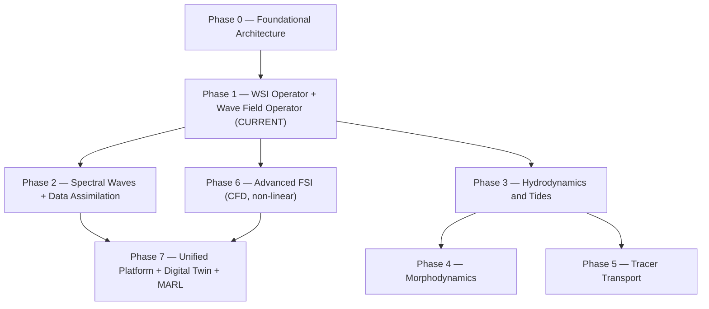

# NOSSO-MAR — Full Roadmap

## Phase diagram

## Phase descriptions

### Phase 0 — Foundational Architecture ✓
- IO contracts (`core/contracts.py`)
- Operator families (FNO, WNO, GNO, DeepONet, RINO)
- Open data pipeline
- Test suite (TDD)

### Phase 1 — WSI + Wave Field Operators (IN PROGRESS)
- F1A: Wave-Structure Interaction (DeepONet) — WEC hydrodynamic coefficients
- F1B: Wave field propagation (FNO/WNO) — η(x,y,t)
- F1C: Bidirectional coupling F1A ↔ F1B
- Target: 100×–1000× speedup vs. classical solvers

### Phase 2 — Spectral Waves + Data Assimilation
- Integration with spectral models (WAVEWATCH III, ERA5)
- Ensemble Kalman Filter (EnKF) with neural operator forecast model
- Observation assimilation: buoys, satellite altimeters
- Operational forecast cycles

### Phase 3 — Hydrodynamics and Tides
- Tidal module: barotropic dynamics, harmonic constituents
- Currents + wave-current interaction
- Setup and runup

### Phase 4 — Morphodynamics
- Sediment transport (bedload + suspended)
- Shoreline evolution
- Bidirectional coupling with wave propagation

### Phase 5 — Tracer Transport
- Temperature, salinity, SPM, contaminants
- Coupling with velocity field (Phase 3)

### Phase 6 — Advanced FSI
- Full non-linear CFD (incompressible Navier-Stokes)
- Large deformations, non-linear Froude-Krylov
- High-fidelity reference to calibrate Phase 1 surrogates

### Phase 7 — Unified Platform
- Operational digital twin with real-time sensor ingestion
- MARL: layout optimisation (MADDPG) + PTO control (MAPPO)
- REST API for external access
- HPC support: LUMI, MareNostrum 5, Leonardo

## Current status

See [PHASE_1_ROADMAP.md](PHASE_1_ROADMAP.md) for the detailed Phase 1 checklist.
